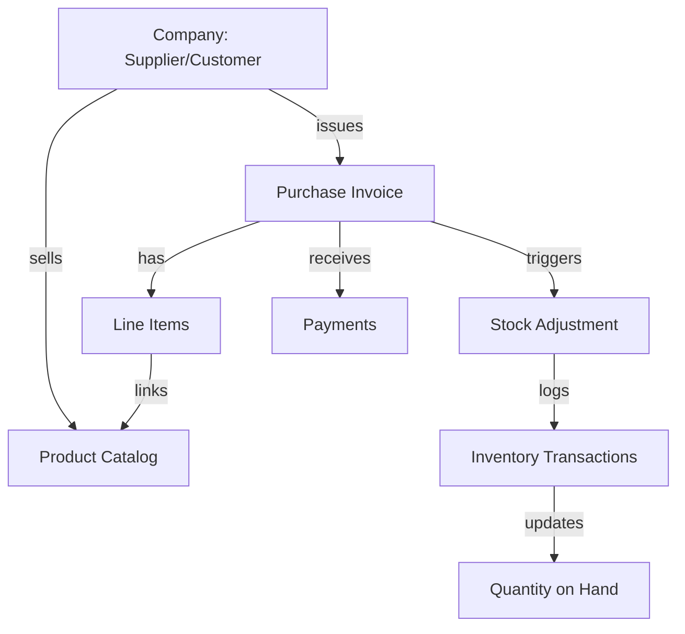

# SeplorX Overview

SeplorX is a shipping and logistics management portal that acts as a central hub for integrating third-party shipping APIs, e-commerce channels, and managing business operations.

## System Design

SeplorX follows a strictly tiered architecture with a strong decoupling of data fetching (DAL) from business mutations (Server Actions) and the UI layer.

### Two-Phase Agent Approval Pattern
AI Agents in SeplorX are **read-only reasoning engines**. 
1. **Phase 1**: Agent analyzes data and proposes a **Plan JSON** into the `agent_actions` table.
2. **Phase 2**: A human reviews the plan and clicks "Approve", triggering a **Server Action** that performs the actual validated database writes.

## Business Domains & Data Flow

SeplorX organizes data around the following business entities:

### Key Business Components

1. **Companies**: Distinct from users; represent business entities.
2. **Products**: Catalog with SKUs and cached stock levels.
3. **Invoices**: Bills received from suppliers; status updates via payments.
4. **Channels**: Multi-instance e-commerce integrations (WooCommerce, Amazon, Shopify).
5. **Apps**: Logistics/SMS/Payment integrations with shared config registry.

## Common Patterns

- **Registry System**: Add new channels or apps by adding a TypeScript object in the registry. No DB migration is needed.
- **JSONB Config**: Encrypted credentials and dynamic fields are stored in a single JSONB column, validated by Zod schemas generated on the fly.
- **Sync/Publish Queue**: Changes to channel items are staged as a log (`channel_product_changelog`) and pushed to marketplaces using a minimal "latest wins" delta merge logic.
